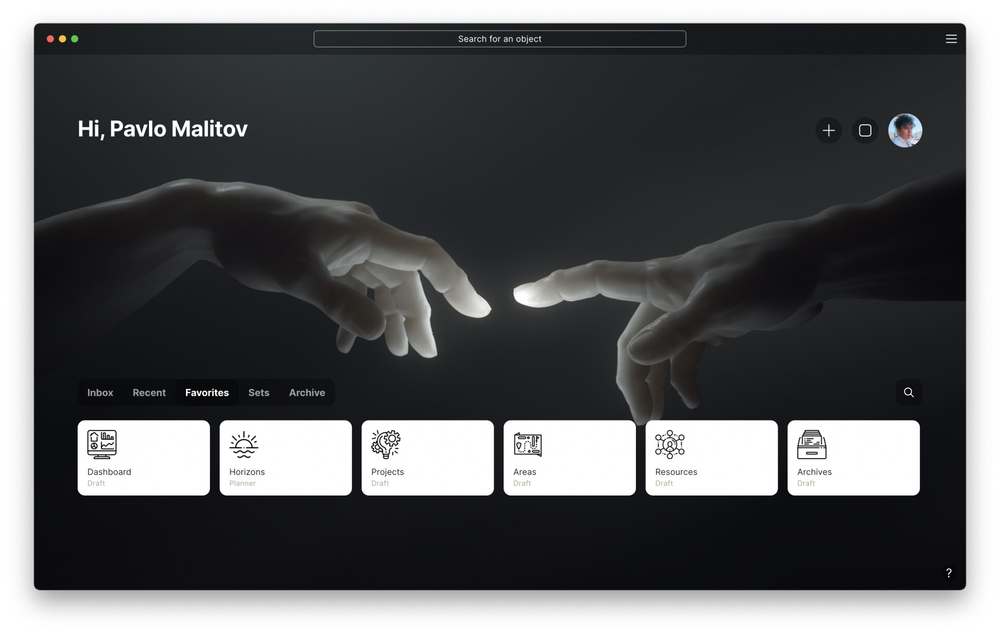

   
  
   
   

🎉🎉 Meet Anytype Custom UI Styles 🎉🎉

# AnyType Custom UI Style Development Proposal

## Overview

The objective of this project is to enhance the user experience within AnyType by introducing a custom UI style. The proposed solution involves creating a versatile and user-friendly interface that allows users to choose between different builds with ease.

## Technical Framework

AnyType is developed using [ElectronJS](https://www.electronjs.org/), a robust framework for building cross-platform desktop applications using JavaScript, HTML, and CSS.

## Simplifying User Experience

To simplify the customization process and make it more accessible, the following approach will be implemented:

### 1. Single CSS File

A unified CSS file will be created to control the UI across various devices, such as phones and PCs. Utilizing @media queries, particularly Bootstrap media sizes, will ensure responsiveness without the need for a complex compilation process.

### 2. Unique @media Styles

Each @media query will be meticulously crafted to provide a unique and optimized style for different screen sizes. This ensures a seamless user experience across a variety of devices.

### 3. Custom Styling for Object Pages

Individual object pages will receive custom styling, enhancing the visual appeal and usability of specific components.

### 4. Custom Fonts Styles

A carefully curated selection of custom font styles will be integrated, allowing users to personalize their experience further.

### 5. Right-to-Left (RTL) Support

Ensuring RTL support is a priority, acknowledging the importance of catering to diverse language and reading preferences.

### 6. Streamlined Process

The proposed solution eliminates the need for complex SCSS or JavaScript configurations, relying solely on one CSS file for UI control.

## Implementation

The implementation will follow a systematic approach, focusing on the outlined components to deliver a cohesive and visually appealing custom UI style for AnyType's main page.

## Conclusion

By implementing this custom UI style, AnyType aims to offer users a seamless and personalized experience, aligning with modern design standards and user preferences. The proposed framework ensures simplicity in customization while maintaining a high level of flexibility and creativity.

## Official Documentation

- [Get the App](https://download.anytype.io/)
- [AnyType Documentation](https://docs.anytype.io/): Explore the official documentation for in-depth information on using AnyType, its features, and best practices.
- [Blog](https://blog.anytype.io/)
- [FAQ](https://anytype.io/faq)
- [join to contribute](https://anytype.io/contributors)
- [ANY Experience Gallery](https://gallery.any.coop/) : Explore experiences made by power users, Simply install to your space and boost up your workflow.

## Contribution Guidelines

Feel free to contribute by adding new links, tutorials, or resources. Follow these guidelines:

1. Fork the repository.
2. Create a new branch.
3. Add your content.
4. Create a pull request.

Let's build a comprehensive resource hub for the AnyType community together!

---

## Contributors

👏 A big thank you to the following individuals who have contributed to this Awesome Repo:

---

 
   

## License

This project is licensed under the [MIT License](LICENSE).

**🤩Happy organizing with AnyType!**
